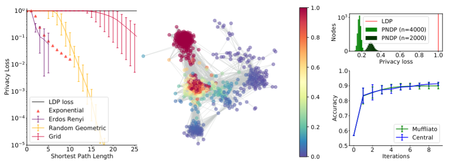

# Muffliato

This private repository contains the code for the paper *Muffliato: Peer-to-Peer Privacy Amplification for Decentralized Optimization and Averaging*.



## Requirements

The following packages are used:
    numpy
    matplotlib
    scikit-learn
    scipy
    networkx
    tqdm
    typer
    pathlib

## Data

The Facebook ego graph can be downloaded here: https://snap.stanford.edu/data/ego-Facebook.html and should be placed in a folder named 'facebook' in the project folder.
The Housing dataset should be downloaded via the 'data' script, but can be manually retrieved there in case of problem: https://www.openml.org/d/823

## To reproduce the figures of the main paper

### Fig a

Run `figa.py`

### Fig b

After downloading the Facebook Ego dataset as indicated before, run `figb.py`

### Fig c

Run `gd.py` to generate the data (takes several minutes, you can reduce the number of trials by adding '--n_trials 2 < INT< 10'). The files are saved in a folder 'result' 
Run `draw.py` to generate the figure b on two seperate runs simulated with the `gd.py` files. Beware that you should specifiy which runs you want to use.

In command lines, to reproduce with the same parameters as in figure b
```
mkdir result
python gd.py --n-trials 10 --n-nodes 2000 --prefix "big"
python gd.py --n-trials 10 --n-nodes 4000 --prefix "huge"
python draw.py
```

## To reproduce the figures of the supplementary material

Run `fig2.py --graph-name hypercube/ER/geometric/grid` to reproduce the figure 2. If no parameter is given, hypercube is used. You can also modify the number of nodes of those graphs.

Run `fig3.py`to reproduce the Figure 3.

Run `fig4.py` to reproduce the Figure 4. Although no direct command is provided, you can easily modify the number of nodes, the positions of the node and the radius and starting node via variables n, pos, and u (line 24 to 30).

Run `fig5.py` to reproduce the Figure 5, after downloading the Facebook Ego graph as indicated before.

To generate a run of figure 6, run `versatile.py` by putting the seed in parameter and a prefix. This generates the two `npy` with the privacy loss and the mean square error at each step. By putting the list of the prefix generated, the plot can be done using `fig6.py`.


## Short description of the files

**Core of the project**
- `graphutils.py` Several useful functions such as building the gossip matrix and computing the spectral gap
- `muffliato.py` Muffliato algorithm, non accelerated and accelerated version
- `ERsampled.py` privacy leakage for Erdös Renyi graph drawn randomly (theorem 4)

**For synthetic experiments**
- `figa.py` for comparing several graphs as described in the main text
- `fig2.py` for visualizing the privacy loss of a fixed node on several graphs
- `fig3.py` for the privacy loss of the exponential graph
- `fig4.py` for the privacy loss as function of euclidean distance for random geometric graphs.
- `fig6.py` for visualizing the privacy with dropout
- `versatile.py` for generating runs with dropout

**For Fb experiments**
- `figb.py` generates the current Fb drawing, you can change the ego variable to run simulation on other graphs
- `fig5.py` to generate the full gallery of Ego graphs.

**For the Gradient Descent part**
- `data.py` Used for preprocessing the Housing dataset for the logistic regression
- `gd.py` Main file for the logistic regression
- `private.py` logistic regression utils and construction of Muffliato Logistic Regression algorithm

